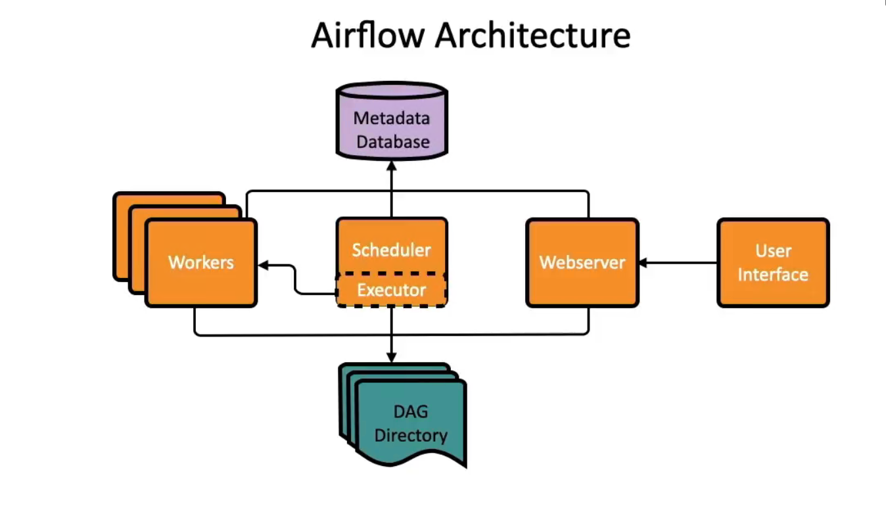

# Apache Airflow code examples and full data pipelines

This repository mainly for my practice and contains code snippets learning and practice Apache Airflow.
It also may help others in how to start, learn and practice Airflow to create solid, secure, and maintainable workflows in Python.

## Pre-requisite

To run the following codes and workflows you need a development environment similar as mine.

- Linux (*"Windows 11 WSL2 - Ubuntu-24.04"*)
- Python  (*"Python 3.12.3"*)
- Local database (*sqlite and/or postgresql, installed/docker/etc.*)
- Set environment variables
    - AIRFLOW_HOME: project directory
    - AIRFLOW__DATABASE__SQL_ALCHEMY_CONN: connection for the database, e.g.:
        - `sqlite:////home/<user_name>/<path-to-the-project>/<db-folder>/sqlite.db`
        - `postgresql+psycopg2://<user>:<password>@<host>/<db>`

There is a bash script named `setup.sh` that helps to:
- Create a virtual environment (*venv => .venv*)
- Install the required dependencies (*apache airflow, pandas, SQLAlchemy, sqlite3, postgres, etc.*)

## Run the workflows

- First you need to create/setup your local database(s)
- Initialize the database backend: `airflow db init`: 
- Create a user for yourself: `airflow users create -e email -u username -p password -r role -f firstName -l lastName` (*role=Admin*)
- You can check it by: `airflow users list`
- You can modify the airflow config in airflow.cfg
    - If you don't want see the default examples - `load_examples = False`
    - If you want to check db connection in the UI - `test_connection = Enabled`
- Run the scheduler: `airflow scheduler` (*It monitors all tasks and DAGs, then triggers the task with the pre-configured `executor`. - [See more..](#scheduler)*)
- Run the webserver: `airflow webserver` (*It gives you access the Airflow UI. - [See more..](#webserver-and-ui)*)

# Summary of Apache Airflow and its components

Apache Airflow is an Open-source platform for developing, scheduling, and monitoring batch workflows.

- Workflow manager that can schedule individual tasks to run as part of a processing pipeline.
- Specify and manage dependencies between tasks and make sure they are executed in the right order.
- Workflow-as-code, so everything is written with Python code.
- Contains operators to connect with external technologies.
- Can be parameterized with Jinja template
- Modularized architecture (scheduler, executor, metadata db, web server)
- Workflows are represented as a DAG.

## Webserver and UI

**Provides user interface to inspect, trigger, and debug our DAGs and tasks and also to configure many-many options.**

## Scheduler 

**Scheduler is the orchestrator for Airflow’s workflow management system that triggers the workflows and submits tasks to the executor to run.**

## Executor

**Executors receive tasks from the `scheduler` and execute them.**

*(SequentialExecutor, LocalExecutor, CeleryExecutor, KubernetesExecutor)*

## Worker

**Worker nodes which are in a cluster execute tasks in parallel.**

## Metadata DB

**Metadata DB stores configurations, roles, permissions, as well as all metadata for each workflow.**

## DAG Directory

**Directory that contains DAG definitions and code.**